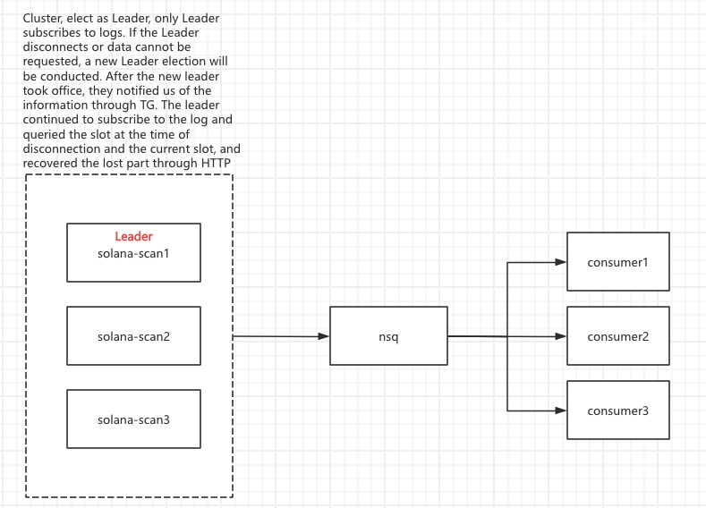

# Block_Scanner
## Framework



**<span style="color:red;;">Notice: Disable the nsq port to prevent external network access</span>**

```shell
# Disable the nsq ports
sudo iptables -I INPUT -p tcp -s 172.31.0.0/16 --dport 27873 -j DROP
sudo iptables -I INPUT -p tcp -s 172.31.0.0/16 --dport 4150 -j DROP
sudo iptables -I INPUT -p tcp -s 172.31.0.0/16 --dport 4151 -j DROP
sudo iptables -I INPUT -p tcp -s 172.31.0.0/16 --dport 4160 -j DROP
sudo iptables -I INPUT -p tcp -s 172.31.0.0/16 --dport 4161 -j DROP
# Enable the nsq ports
sudo iptables -D INPUT -p tcp -s 172.31.0.0/16 --dport 4150 -j DROP
sudo iptables -D INPUT -p tcp -s 172.31.0.0/16 --dport 4151 -j DROP
sudo iptables -D INPUT -p tcp -s 172.31.0.0/16 --dport 4160 -j DROP
sudo iptables -D INPUT -p tcp -s 172.31.0.0/16 --dport 4161 -j DROP

```

```shell
# View disabled rules
sudo iptables -L INPUT --line-numbers
# Disable the nsq ports
sudo iptables -I INPUT -p tcp -s 0.0.0.0/0 --dport 4150 -j DROP
sudo iptables -I INPUT -p tcp -s 0.0.0.0/0 --dport 4151 -j DROP
sudo iptables -I INPUT -p tcp -s 0.0.0.0/0 --dport 4160 -j DROP
sudo iptables -I INPUT -p tcp -s 0.0.0.0/0 --dport 4161 -j DROP
sudo iptables -I INPUT -p udp -s 0.0.0.0/0 --dport 4150 -j DROP
sudo iptables -I INPUT -p udp -s 0.0.0.0/0 --dport 4151 -j DROP
sudo iptables -I INPUT -p udp -s 0.0.0.0/0 --dport 4160 -j DROP
sudo iptables -I INPUT -p udp -s 0.0.0.0/0 --dport 4161 -j DROP
sudo iptables -I INPUT -p tcp -s 172.31.0.0/16 --dport 4150 -j ACCEPT
sudo iptables -I INPUT -p tcp -s 172.31.0.0/16 --dport 4151 -j ACCEPT
sudo iptables -I INPUT -p tcp -s 172.31.0.0/16 --dport 4160 -j ACCEPT
sudo iptables -I INPUT -p tcp -s 172.31.0.0/16 --dport 4161 -j ACCEPT
sudo iptables -I INPUT -p udp -s 172.31.0.0/16 --dport 4150 -j ACCEPT
sudo iptables -I INPUT -p udp -s 172.31.0.0/16 --dport 4151 -j ACCEPT
sudo iptables -I INPUT -p udp -s 172.31.0.0/16 --dport 4160 -j ACCEPT
sudo iptables -I INPUT -p udp -s 172.31.0.0/16 --dport 4161 -j ACCEPT
# Enable the nsq ports
sudo iptables -D INPUT -p tcp -s 172.31.0.0/16 --dport 4150 -j ACCEPT
sudo iptables -D INPUT -p tcp -s 172.31.0.0/16 --dport 4151 -j ACCEPT
sudo iptables -D INPUT -p tcp -s 172.31.0.0/16 --dport 4160 -j ACCEPT
sudo iptables -D INPUT -p tcp -s 172.31.0.0/16 --dport 4161 -j ACCEPT
sudo iptables -D INPUT -p udp -s 172.31.0.0/16 --dport 4150 -j ACCEPT
sudo iptables -D INPUT -p udp -s 172.31.0.0/16 --dport 4151 -j ACCEPT
sudo iptables -D INPUT -p udp -s 172.31.0.0/16 --dport 4160 -j ACCEPT
sudo iptables -D INPUT -p udp -s 172.31.0.0/16 --dport 4161 -j ACCEPT
sudo iptables -D INPUT -p tcp -s 0.0.0.0/0 --dport 4150 -j DROP
sudo iptables -D INPUT -p tcp -s 0.0.0.0/0 --dport 4151 -j DROP
sudo iptables -D INPUT -p tcp -s 0.0.0.0/0 --dport 4160 -j DROP
sudo iptables -D INPUT -p tcp -s 0.0.0.0/0 --dport 4161 -j DROP
sudo iptables -D INPUT -p udp -s 0.0.0.0/0 --dport 4150 -j DROP
sudo iptables -D INPUT -p udp -s 0.0.0.0/0 --dport 4151 -j DROP
sudo iptables -D INPUT -p udp -s 0.0.0.0/0 --dport 4160 -j DROP
sudo iptables -D INPUT -p udp -s 0.0.0.0/0 --dport 4161 -j DROP
```
-s 0.0.0.0/0

